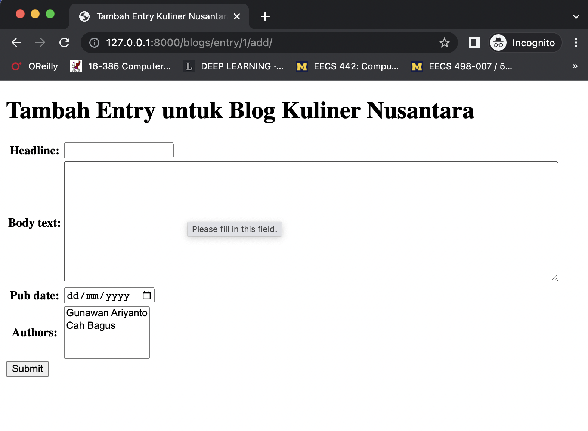

[](https://classroom.github.com/online_ide?assignment_repo_id=8897307&assignment_repo_type=AssignmentRepo)
# Tugas ke-1 Pemrograman Web berbasis Framework: Membuat aplikasi blog sederhana dengan Django

## Pengantar
Tugas kali ini adalah mengimplementasikan website berupa blog sederhana menggunakan framework Django.

Design database blog yang akan kita buat diambil dari tutorial Django.
```python
from datetime import date

from django.db import models

class Blog(models.Model):
    name = models.CharField(max_length=100)
    tagline = models.TextField()

    def __str__(self):
        return self.name

class Author(models.Model):
    name = models.CharField(max_length=200)
    email = models.EmailField()

    def __str__(self):
        return self.name

class Entry(models.Model):
    blog = models.ForeignKey(Blog, on_delete=models.CASCADE)
    headline = models.CharField(max_length=255)
    body_text = models.TextField()
    pub_date = models.DateField()
    mod_date = models.DateField(default=date.today)
    authors = models.ManyToManyField(Author)
    number_of_comments = models.IntegerField(default=0)
    number_of_pingbacks = models.IntegerField(default=0)
    rating = models.IntegerField(default=5)

    def __str__(self):
        return self.headline
```

Di dalam tugas ini terdapat tiga bagian yang harus anda implementasikan.
1) Melengkapi urls.py
2) Melengkapi views.py
3) Melengkapi dan menambahkan file templates

## Langkah awalan
### 1. Pastikan anda membuat virtual environtment `.venv`
```bash
$ python -m venv .venv
```

### 2. Aktifkan virtual environtment
Untuk MacOs dan Linux (Bash atau Zsh Shell)
```bash
$ source .venv/bin/activate
```
Untuk Windows Command Shell
```bash
$ ./venv/Scripts/activate
```

### 3. Upgrade pip
```bash
(.venv) $ pip install pip --upgrade
```

### 4. Install Django menggunakan pip
```bash
(.venv) $ pip install Django
```
## Langkah-langkah mengerjakan tugas
Untuk menyelesaikan tugas ini, anda cukup menjawab dan mengimplementasikan 6 pertanyaan berikut:
### 1. Menambahkan path urls blog ke urlpatterns project.<br >
Buka file `tugas1/urls.py` kemudian **lengkapi bagian berikut**:
```py
urlpatterns = [
    path('admin/', admin.site.urls),
    # TODO: Soal 1. Tambahkan path urls blog ke urlpatterns
    # path(...),  # ganti baris ini dengan jawaban anda
]
```
Setelah anda menyelesaikan soal no. 1 dan mengakses halaman home http://127.0.0.1:8000  maka akan tampil halaman seperti berikut ini.


### 2. Menampilkan daftar blogs http://127.0.0.1:8000/blogs/
Perhatikan file `blogs/urls.py`
```py
urlpatterns = [
    ## Menampilkan daftar blogs
    # ex: /blogs/
    path('', views.index, name='index'),
```
Perhatikan file `blogs/views.py` baris ke 5 s/d 12.
```py
from .models import Blog, Author, Entry

def index(request):
    blogs = Blog.objects.all()
    data = {
        'blogs': blogs,
    }
    return render(request, 'blogs/index.html', data)
```
fungsi `index` yang ada di `views.py` akan memanggil template `blogs/index.html`. **Lengkapi template tersebut** agar ketika kita mengakses halaman ini http://127.0.0.1:8000/blogs/ akan memunculkan semua nama dan tagline blog seperti gambar di bawah ini. Setiap item blog harus memiliki link sehingga ketika diklik akan menampilkan semua daftar entry (tulisan) yang dimiliki oleh blog tersebut.


### 3. Menampilkan entry (tulisan) di setiap blog http://127.0.0.1:8000/blogs/entry/2/
Perhatikan file `blogs/urls.py` pada baris ke 11 s/d 13.
```py
## Menampilkan entry (tulisan) di setiap blog
# ex: /blogs/entry/2/
path('entry/<int:blog_id>/', views.blog_entries, name='blog_entries'),
```
**Tugas anda adalah** melengkapi `views.py` pada bagian `blog_entries` berikut 
```py
def blog_entries(request, blog_id):
    """
    Function-based view untuk menampilkan daftar entry suatu blog.
    View ini menggunakan template 'blogs/blog_entries.html'
    """
    # TODO: SOAL No.3 Implementasikan fungsi ini dan gunakan template 'blogs/blog_entries.html'
    pass
```
Pastikan ketika anda membuka http://127.0.0.1:8000/blogs/entry/2/ akan menampilkan halaman seperti gambar berikut.


### 4. Menampilkan detail entry http://127.0.0.1:8000/blogs/entry/detail/4/
Perhatikan file `blogs/urls.py` pada baris ke 14 s/d 15.
```py
# ex: /blogs/entry/detail/4/
path('entry/detail/<int:entry_id>/', views.entry_detail, name='entry_detail'),
```
**Tugas anda adalah** melengkapi `views.py` pada bagian `entry_detail` berikut
```py
def entry_detail(request, entry_id):
    """
    Function-based view untuk menampilkan detail suatu entry.
    View ini menggunakan template 'blogs/entry_detail.html'
    """
    # TODO: SOAL No.4 Implementasikan fungsi ini dan gunakan template 'blogs/author_entries.html'
    pass
```
Pastikan ketika anda membuka http://127.0.0.1:8000/blogs/entry/detail/4/ akan menampilkan halaman seperti gambar berikut.


### 5. Menampilkan daftar entry (tulisan) dari setiap Author (penulis) http://127.0.0.1:8000/blogs/entry/author/1/
Perhatikan file `blogs/urls.py` pada baris ke 17 s/d 19.
```py
## Menampilkan entry (tulisan) dari setiap Author (penulis)
# ex: /blogs/entry/author/1/
path('entry/author/<int:author_id>/', views.author_entries, name='author_entries'),
```
**Tugas anda adalah** melengkapi `views.py` pada bagian `author_entries` berikut
```py
def author_entries(request, author_id):
    """
    Function-based view untuk menampilkan semua entries (tulisan) dari author.
    View ini menggunakan template 'blogs/author_entries.html'
    """
    # TODO: SOAL No.5 Implementasikan fungsi ini dan gunakan template 'blogs/author_entries.html'
    pass
```
Pastikan ketika anda membuka http://127.0.0.1:8000/blogs/entry/author/1/ akan menampilkan halaman seperti gambar berikut.


### 6. Memastikan author untuk login terlebih dahulu ketika akan menambahkan entry (tulisan) ke dalam blog http://127.0.0.1:8000/blogs/entry/1/add/
Ketika kita mengakses halaman untuk menambahkan entry pada blog Kuliner Nusantara http://127.0.0.1:8000/blogs/entry/1/add/
, maka semua orang bisa mengaksesnya tanpa perlu login terlebih dahulu. **Tugas anda adalah** menambahkan decorator ke dalam fungsi `add_entry` berikut, sehingga user akan diarahkan ke login page terlebih dahulu.
```py
# TODO: SOAL No.6 Pastikan user harus login terlebih dahulu sebelum bisa menambahkan entry.
# Bisa dilakukan dengan menambahkan decorator login_required
# atau dengan mengecek isi request.user
def add_entry(request, blog_id):
    if request.method == 'POST':
```


Untuk login ke website, masukan user: admin dan
password: !ADqswe3pNa!8ES8


Apabila user telah berhasil login ke webiste, maka akan ditampilkan halaman untuk menambahkan entry seperti yang ada di gambar berikut.


## Lain-Lain
### 1. Halaman Admin
Jika anda ingin mengakses halaman admin, gunakan credential berikut ini:
user: admin <br >
password: !ADqswe3pNa!8ES8

Anda bebas untuk menambahkan atau mengedit data yang sudah ada. Dengan admin page anda bisa menambahkan user baru, menambahkan blog, author dan juga entry baru.

### 2. Mengetes jawaban di mesin lokal 
Untuk mengetes jawaban secara keseluruhan anda bisa menjalankan perintah Django test seperti berikut:
```bash
(.venv) $ python manage.py test
```
Jika anda ingin mengetes jawaban anda di setiap soal, gunakan perintah berikut
```bash
(.venv) $ python manage.py test blogs.tests.test_1
```
Ganti angka 1 di atas dengan nomor soal yang akan anda test (no 1 s.d 6).

Jika hasil test masih `FAILED` atau ada pesan `errors`, maka periksa dan perbaiki kembali jawaban anda.
### 3. Pilih NIM di GitHub Classroom
Ketika anda menerima invitation dari GitHub Classroom, pastikan anda memilih NIM anda, bukan NIM mhs lainnya!

### 4. Slack Discussion
Jika ada hal yang perlu ditanyakan, silahkan diposting di Slack channel `#general`.

